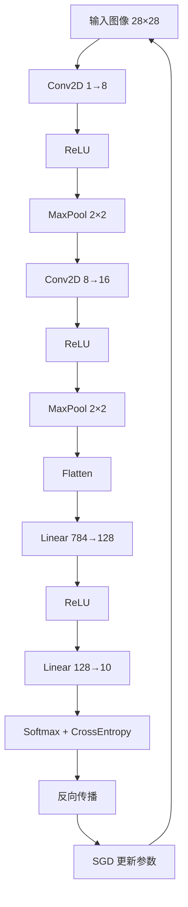

# 卷积神经网络

> 不依赖任何深度学习框架，用纯底层运算实现一个完整的 CNN，用于深入理解卷积神经网络的原理。

## 项目结构

```
cnn/
├── mini_cnn.py    # 核心实现：所有层、损失函数、优化器
├── train.py       # 训练脚本：数据加载、训练循环、评估
├── data/          # 运行时自动下载 MNIST 数据
└── README.md
```

## 快速开始

```bash
# 仅需 numpy
pip install numpy

# 运行训练（自动下载 MNIST）
python train.py
```

## 网络结构

```
Input (1, 28, 28)         ← MNIST 灰度图像
  │
  ├─ Conv2D(1→8, 3×3, pad=1)   输出: (8, 28, 28)
  ├─ ReLU                       输出: (8, 28, 28)
  ├─ MaxPool2D(2×2)             输出: (8, 14, 14)
  │
  ├─ Conv2D(8→16, 3×3, pad=1)  输出: (16, 14, 14)
  ├─ ReLU                       输出: (16, 14, 14)
  ├─ MaxPool2D(2×2)             输出: (16, 7, 7)
  │
  ├─ Flatten                    输出: (784,)
  ├─ Linear(784→128)            输出: (128,)
  ├─ ReLU                       输出: (128,)
  └─ Linear(128→10)             输出: (10,)  ← 10 类 logits
```

## 核心原理详解

### 1. 卷积运算 (Conv2D)

**前向传播：** 使用 `im2col` 技巧将卷积转化为矩阵乘法。

```
卷积核 W: (C_out, C_in, kH, kW)
输入 X:   (N, C_in, H, W)

im2col 展开 X → cols: (N*out_h*out_w, C_in*kH*kW)
W reshape      → W_col: (C_out, C_in*kH*kW)

输出 = cols @ W_col^T + b    → reshape → (N, C_out, out_h, out_w)
```

输出尺寸公式：
```
out_h = (H + 2*padding - kernel_h) / stride + 1
out_w = (W + 2*padding - kernel_w) / stride + 1
```

**反向传播：**
```
dW = dout^T @ cols           # 权重梯度
db = sum(dout)               # 偏置梯度
dcols = dout @ W_col         # 展开空间的输入梯度
dx = col2im(dcols)           # 还原回图像形状
```

### 2. 最大池化 (MaxPool2D)

**前向传播：** 每个窗口取最大值。
```
窗口 [1, 3,     → max = 5，记录 argmax = 位置 (1,1)
      5, 2]
```

**反向传播：** 梯度只传回前向时取最大值的位置，其余位置梯度为 0。

### 3. ReLU 激活

```
前向：y = max(0, x)
反向：dy/dx = 1 (若 x > 0)，否则 0
```

### 4. 全连接层 (Linear)

```
前向：y = xW^T + b
反向：
  dW = dout^T @ x
  db = sum(dout, axis=0)
  dx = dout @ W
```

### 5. Softmax + 交叉熵损失

**合并计算**的好处：梯度形式极其简洁。

```
前向：
  probs = softmax(logits)
  loss = -mean(log(probs[correct_class]))

反向（合并梯度）：
  dL/d_logits = probs - one_hot(labels)
```

推导：softmax 和交叉熵组合后，中间的链式法则抵消，得到这个简洁形式。

### 6. SGD + Momentum 优化器

```
v = momentum * v - lr * grad
param = param + v
```

动量帮助跳出局部最优，加速收敛。

## 代码核心流程图



## 训练参数

| 参数 | 默认值 | 说明 |
|------|--------|------|
| `epochs` | 5 | 训练轮数 |
| `batch_size` | 64 | 批大小 |
| `lr` | 0.01 | 学习率 |
| `momentum` | 0.9 | SGD 动量 |

修改 `train.py` 末尾的参数即可调整：
```python
model = train(epochs=10, batch_size=128, lr=0.005)
```

## 学习建议

1. **从 `mini_cnn.py` 开始**，按顺序阅读每个层的实现
2. **重点关注 `Conv2D` 的 `im2col`** —— 这是理解卷积计算效率的关键
3. **手写推导反向传播** —— 尤其是 Softmax+CrossEntropy 的合并梯度
4. **修改网络结构** —— 尝试增减层数、改变通道数，观察效果
5. **调参实验** —— 改变学习率、batch_size，体会超参数的影响

## 预期结果

5 个 epoch 后，测试集准确率约 **96%~98%**（纯 NumPy 实现，无数据增强）。
